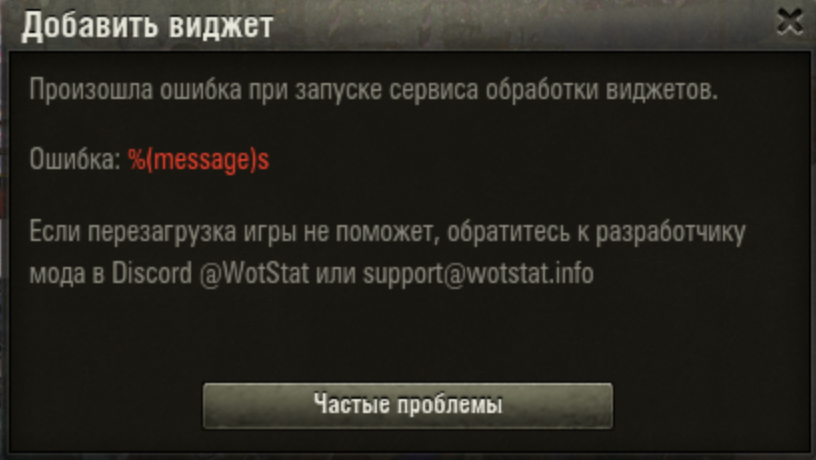
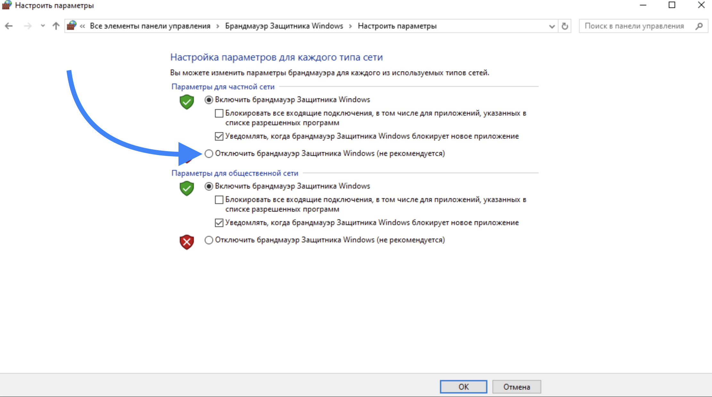
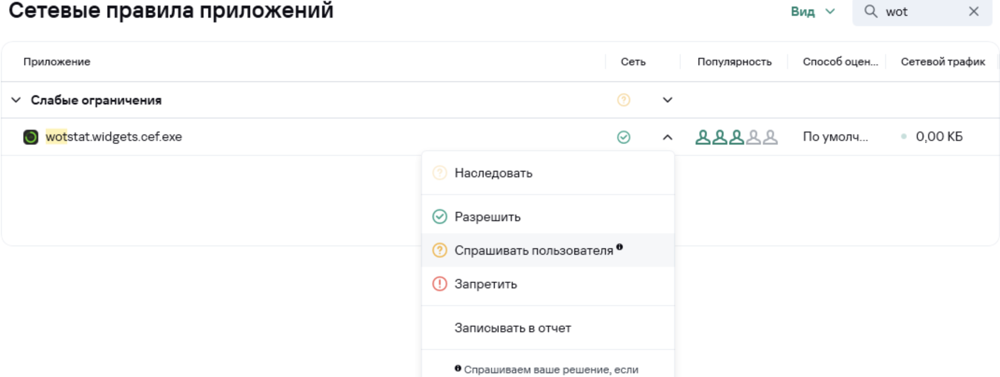

# Частые проблемы и способы их решения

Если столкнулись с проблемой, напишите в Discord [@WotStat](https://discord.gg/7K8W9JE6xU){target=_blank} или в на электронную почту [support@wotstat.info](mailto:support@wotstat.info){target=_blank}.

## Наиболее частая проблема
Мод корректно установлен, запустился, однако окно с добавлением виджета пишет ошибку

{.small .center}

Это ошибка означает, что мод не может связаться с дочерним процессом обработки виджетов `wotstat.widgets.cef.exe` по адресу `localhost:33100`

Соединение может блокироваться по разным причинам. Ниже представлены причины, с которыми сталкивались пользователи

### Брендмауэр
Попробуйте отключить брендмауэр системы, либо добавить исключение для `wotstat.widgets.cef.exe`

{.medium .center}

### Антивирус
В некоторых антивирусах есть функция блокировки сетевых соединений. Попробуйте добавить исключение для `wotstat.widgets.cef.exe`  
**Пример для Касперского:**
{.medium .center}

### Visual C++ 2015–2019 Redistributable
На некоторых сборках Windows не предустановлены необходимые компоненты Visual C++. Попробуйте установить [Visual C++ 2015–2019 Redistributable](https://aka.ms/vs/17/release/vc_redist.x64.exe){target=_blank}. Ссылка взята с официального сайта [Microsoft](https://learn.microsoft.com/en-us/cpp/windows/latest-supported-vc-redist?view=msvc-170#latest-microsoft-visual-c-redistributable-version){target=_blank}

### Discord
Одному из пользователей помогло закрытие Discord на момент запуска игры. Это сомнительный способ, но можете попробовать 

<!-- 
### Распространяемые пакеты Visual C++
Возможно, у вас урезанная ОС с вырезанными компонентами Visual C++. Скачайте их с сайта Microsoft: [microsoft.com/ru-ru/download/details.aspx?id=40784](https://www.microsoft.com/ru-ru/download/details.aspx?id=40784){target=_blank}. Обычно они предустановлены в системе. -->

### Другие решение
Если вы нашли другое решение, пожалуйста, сообщите нам, чтобы мы могли добавить его в этот раздел

## Python.log
Если вы достаточно квалифицированы, вы можете попробовать самостоятельно изучить логи игры в файле `python.log`. Он находится в корневой папке игры. В нем могут быть полезные сообщения об ошибках, которые помогут понять причину проблемы.

Если вы сможете самостоятельно разобраться с проблемой, сообщите это решение, чтобы мы могли добавить его в этот раздел.