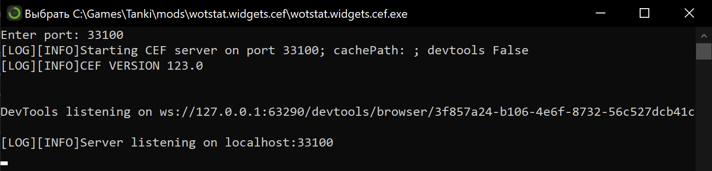

# Частые проблемы и способы их решения

Если столкнулись с проблемой, напишите в Discord [@WotStat](https://discord.gg/7K8W9JE6xU){target=_blank} или в на электронную почту [support@wotstat.info](mailto:support@wotstat.info){target=_blank}.

## Основная проблема
Мод корректно установлен, запустился, однако окно с добавлением виджета пишет ошибку

{.small .center}

Это ошибка означает, что мод не может связаться с дочерним процессом обработки виджетов `wotstat.widgets.cef.exe` по адресу `localhost:33100`

Соединение может блокироваться по разным причинам. Ниже представлены причины, с которыми сталкивались пользователи

## Решение

Первое, что вам следует сделать – запустить `wot/mods/wotstat.widgets.cef/wotstat.widgets.cef.exe` вручную (двойным кликом) при **выключенной** игре. Должно открыться окно с консолью и предложением ввести порт, введите `33100` и нажмите `Enter`.
- Если окно закроется, то переходите к разделу **Visual C++ Redistributable**.
- Если окно осталось открытым, то закройте его и попробуйте снова запустить игру. Если ошибка не исчезла, то переходите к следующим разделам.

*Иногда, система не даёт запускать новые приложения от имени других процессов, однако после ручного запуска, всё начинает работать*

{.medium .center}
:::center
*Пример корректной работы wotstat.widgets.cef.exe*
:::

### Visual C++ Redistributable
На некоторых сборках Windows не предустановлены необходимые компоненты Visual C++. Попробуйте установить [Visual C++ 2015–2022 Redistributable](https://aka.ms/vs/17/release/vc_redist.x64.exe){target=_blank}. Ссылка взята с официального сайта [Microsoft](https://learn.microsoft.com/en-us/cpp/windows/latest-supported-vc-redist?view=msvc-170#latest-microsoft-visual-c-redistributable-version){target=_blank}. Даже если установщик сообщит, что у вас уже установлен этот компонент, нажмите кнопку `Repair` (Исправить) и дождитесь окончания процесса.

> [!NOTE]
> Все последующие шаги пробуйте только после ручного запуска и установки Visual C++ Redistributable.

### Брендмауэр
Попробуйте отключить брендмауэр системы, либо добавить исключение для `wotstat.widgets.cef.exe`

{.medium .center}

### Антивирус
В некоторых антивирусах есть функция блокировки сетевых соединений. Попробуйте добавить исключение для `wotstat.widgets.cef.exe`  
**Пример для Касперского:**
{.medium .center}

### Discord
Одному из пользователей помогло закрытие Discord на момент запуска игры. Это сомнительный способ, но можете попробовать 

### Другие решение
Если вы нашли другое решение, пожалуйста, сообщите нам, чтобы мы могли добавить его в этот раздел

## Python.log
Если вы достаточно квалифицированы, вы можете попробовать самостоятельно изучить логи игры в файле `python.log`. Он находится в корневой папке игры. В нем могут быть полезные сообщения об ошибках, которые помогут понять причину проблемы.

Если вы сможете самостоятельно разобраться с проблемой, сообщите это решение, чтобы мы могли добавить его в этот раздел.