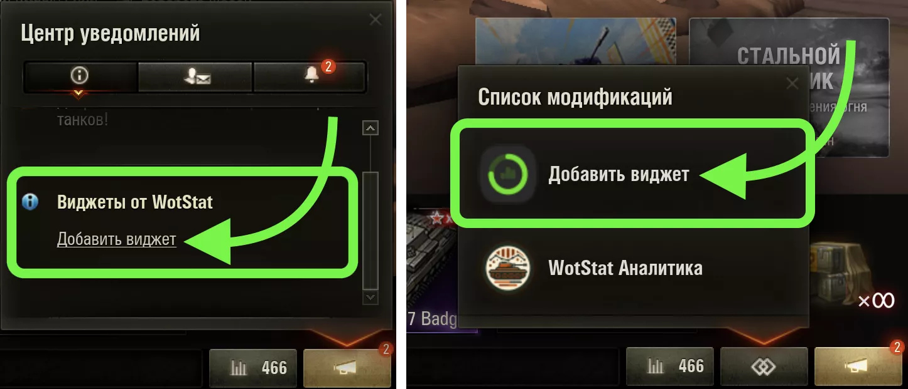

Чтоб добавить виджет прямо в игру вам необходим мод [wotstat-widgets](https://github.com/WOT-STAT/wotstat-widgets){target='_blank'}

1. Установите мод **"Виджеты"** из раздела [Модификаций](https://wotstat.info/install?preset=widgets){target='_blank'} или скачайте и установите его вручную
2. После запуска игры откройте окно добавления виджета (с помощью уведомления или списка модификаций)
3. Укажите ссылку на виджет и нажмите "Добавить"

::: center
{class=add-widget}
:::