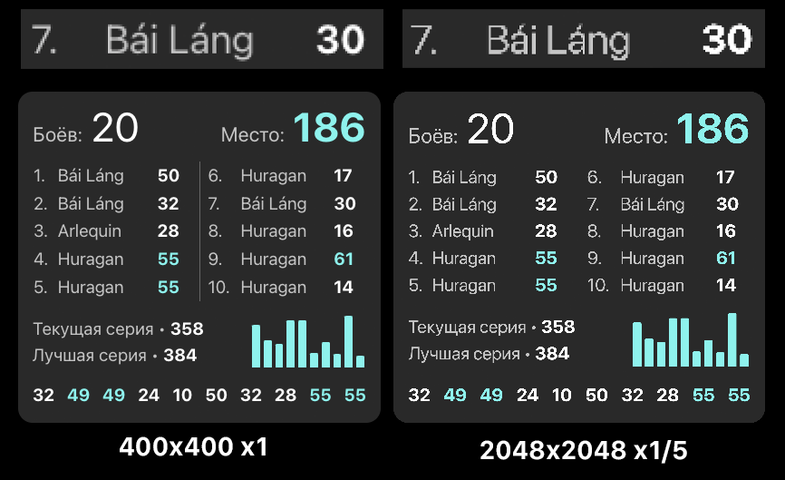

Большинству виджетов для корректной работы необходимо получать данные из игры. 
Для этого подойдёт как [wotstat-widgets](https://github.com/WOT-STAT/wotstat-widgets){target='_blank'} так и легковесный [data-provider](https://github.com/WOT-STAT/data-provider){target='_blank'}.

**Установите мод**

1. Установите мод  **"Виджеты" ИЛИ "Data Provider"** из раздела [Модификаций](https://wotstat.info/install?preset=widgets){target='_blank'} или скачайте и установите его вручную

**Как сбросить накопленные данные**
1. В OBS выберите источник виджета
2. Нажмите кнопку `Взаимодействовать` (снизу)
3. В открывшемся окне, нажмите `ПКМ` в любое место виджета, и выберите `Очистить данные`

**Как правильно добавить виджет**
1. Добавьте источник `Браузер`
2. Установите `ПКМ` → `Метод смешивания` → `SRGB off`. Это нужно для корректного отображения цветов
3. Укажите ему разрешение таким образом, чтоб не нужно было масштабирвоать виджет. Не стоит делать разрешение больше чем необходимо.
4. Чтоб сбросить масштаб виджета до идельного, нажиме по нему правой кнопкой мыши и выберите `Преобразование` → `Сбросить преобразование`

> [!IMPORTANT]
> Уважаемые стримеры, пожалуйста, не устанавливайте слишком большое разрешение виджетам. Это плохо. Теряется сглаживание шрифтов.  
> В идеале виджет должен быть **не** отмасштабированным. В таком случае пиксели виджета будут один к одному переноситься на стрим.

\
**Сравнение качества**
- Первая картинка `400x400` **без масштабирования**
- Вторая картинка `2048x2048` **уменьшенная в OBS** в 5 раз
::: center
{.widget-compare}
:::

\
**Сравнение режима смешивания**
- Первая картинка: `SRGB Off`
- Вторая картинка `SRGB On`

Первые три строчки должны быть абсолютно белыми с разной прозрачностью (0%, 25%, 75%), однако при включенном `SRGB` прозрачность влияет на цвет (белый становится серым). Кроме того, вокруг текста появляются артефакты. Цвета становятся темнее и менее насыщенными. 

::: center
{.srgb-compare}

{.srgb-compare}
:::